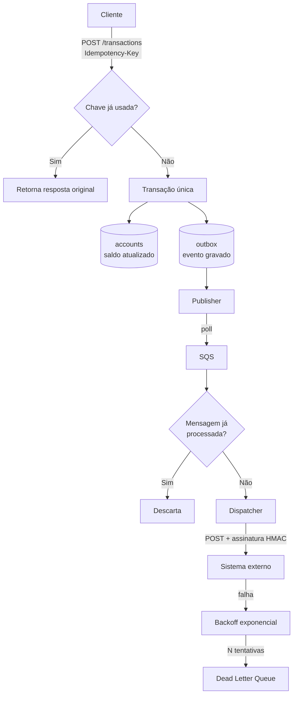

# Ledger Service

API de movimentação de saldo com notificação assíncrona e confiável via webhooks.


---

## O problema

Sistemas que movimentam dinheiro enfrentam dois problemas que raramente aparecem em exemplos didáticos:

**1. A mesma operação pode chegar mais de uma vez.** Timeout de rede, retry automático do cliente ou redelivery de uma fila fazem a mesma requisição bater duas vezes no servidor. Se o serviço não for idempotente, o débito acontece em dobro — e isso é dinheiro real desaparecendo.

**2. Alterar o banco e publicar um evento não são atômicos.** O commit no banco e o envio para a fila são operações independentes, sem transação compartilhada. Se o processo morrer entre as duas, o saldo mudou e ninguém foi notificado. A falha é silenciosa: nenhum erro é registrado, o sistema simplesmente fica inconsistente.

Este projeto ataca os dois.

---

## Objetivo

Construir um serviço de ledger que:

- registra movimentações de saldo com **efeito garantidamente único**, mesmo sob requisições ou mensagens duplicadas;
- notifica sistemas externos via webhook com **garantia de entrega**, tolerando indisponibilidade do destinatário;
- mantém consistência sob **acesso concorrente** à mesma conta;
- permanece **operável**: toda tentativa de entrega é auditável e toda falha é rastreável.

Uma distinção que orienta todo o desenho: não existe *exactly-once delivery* em sistemas distribuídos. O que existe é **at-least-once delivery + idempotência no consumidor**, e o resultado é efeito exatamente-uma-vez. O projeto assume entrega duplicada como caso de uso normal, não como exceção.

---

## Arquitetura



O ponto central: **saldo e evento são gravados na mesma transação de banco**. Ou os dois acontecem, ou nenhum. A publicação para a fila fica a cargo de um processo separado que lê a tabela `outbox` — se ele falhar, o evento continua lá e será reenviado no próximo ciclo. Nunca há saldo alterado sem evento correspondente.

---

## Escopo

### Implementado / planejado

| | Funcionalidade |
|---|---|
<!-- 🔨 = em desenvolvimento · ✅ = concluído e testado · 🔜 = planejado -->
| ✅ | Criação de conta e consulta de saldo |
| ✅ | Movimentação de crédito e débito com `Idempotency-Key` |
| ✅ | Bloqueio de débito que resultaria em saldo negativo |
| 🔨 | Extrato paginado a partir de log imutável |
| 🔜 | Transactional outbox e publicação para SQS |
| 🔜 | Registro de assinaturas de webhook por conta |
| 🔜 | Entrega de webhook com assinatura HMAC |
| 🔜 | Retry com backoff exponencial e Dead Letter Queue |
| 🔜 | Auditoria de tentativas de entrega |
| 🔜 | Health check, métricas e logs com correlation ID |

### Deliberadamente fora de escopo

Delimitar o que o projeto **não** faz é parte do desenho. Cada exclusão tem justificativa:

- **Autenticação completa (OAuth2/JWT)** — API key estática é suficiente. Autenticação é um problema resolvido e não acrescenta nada ao que o projeto se propõe a demonstrar.
- **Multi-moeda com conversão** — cotação, arredondamento e reconciliação cambial são um domínio inteiro à parte.
- **Contabilidade de partidas dobradas** — o ledger de entrada única já exercita toda a complexidade de concorrência e consistência relevante aqui.
- **Interface web** — o produto é a API.
- **Deploy em AWS real** — LocalStack entrega o mesmo aprendizado técnico, com custo zero e reprodutível por qualquer pessoa que clone o repositório.
- **Estorno e chargeback** — regra de negócio densa, sem nenhum desafio distribuído novo.

---

## Tecnologias utilizadas

| Camada | Tecnologia | Papel no projeto |
|---|---|---|
| Linguagem | **Java 21** | Records para DTOs, pattern matching, virtual threads |
| Framework | **Spring Boot 3** | Web, injeção de dependência, transações declarativas |
| Persistência | **Spring Data JPA** + **PostgreSQL** | Constraints de unicidade como garantia de idempotência |
| Migrations | **Flyway** | Schema versionado e reprodutível |
| Mensageria | **AWS SQS** (via LocalStack) | Desacoplamento, retry nativo e DLQ |
| Testes | **JUnit 5**, **Mockito** | Testes de unidade das regras de negócio |
| Testes de integração | **Testcontainers** | PostgreSQL e SQS reais durante os testes |
| Containerização | **Docker** / **Docker Compose** | Ambiente completo em um comando |
| Observabilidade | **Spring Actuator** | Health check e métricas |
| CI | **GitHub Actions** | Build e testes automatizados a cada push |

### Decisões técnicas e seus custos

**`BigDecimal` para valores monetários.** `double` é ponto flutuante binário e não representa decimais exatamente — `0.1 + 0.2` não dá `0.3`. Em domínio financeiro esse erro acumula e vira divergência contábil. Custo: mais verboso e mais lento que primitivos.

**Saldo materializado + log imutável.** A tabela de transações é append-only e o saldo é mantido atualizado na conta. A alternativa — recalcular somando o log a cada leitura — é conceitualmente mais pura, mas degrada linearmente com o volume. Custo aceito: o saldo pode divergir do log em caso de bug, mitigado por um teste de invariante que soma o log e compara com o materializado.

**Outbox em vez de publicação direta.** Garante atomicidade entre efeito e evento. Custo: latência de até um ciclo de polling entre o commit e a publicação — consistência eventual, assumida conscientemente.

**Pessimistic lock (`SELECT ... FOR UPDATE`) no saldo.** Em domínio financeiro a contenção por conta é real, e o retry do optimistic lock sob concorrência alta pode causar starvation. Custo: menor throughput por conta individual.

---

## Como rodar

```bash
git clone https://github.com/LuanLB99/ledger-service.git
cd ledger-service
docker compose up
```

A API sobe em `http://localhost:8080`, com PostgreSQL provisionado. O LocalStack está declarado no `docker-compose.yml` mas comentado — entra quando a outbox e o publisher existirem.

```bash
# Criar conta
curl -X POST http://localhost:8080/accounts \
  -H "Content-Type: application/json" \
  -d '{"holder": "Luan Leal"}'

# Creditar (repita o comando: o saldo não muda na segunda vez)
curl -X POST http://localhost:8080/accounts/{id}/transactions \
  -H "Content-Type: application/json" \
  -H "Idempotency-Key: 7f3e9a1c-4b2d-4e8f-9a1c-2d4e8f9a1c2d" \
  -d '{"type": "CREDIT", "amount": 150.00}'
```

Rodar os testes. As duas faixas são separadas de propósito:

```bash
./mvnw test
```

Faixa rápida: testes unitários de domínio. Sem Spring, sem Docker, poucos segundos.

```bash
./mvnw verify
```

Faixa completa: adiciona os testes de integração ponta a ponta, com PostgreSQL real via Testcontainers. Requer Docker.

---

## Testes

A estratégia prioriza **testes de integração com dependências reais** sobre mocks. Teste com tudo mockado prova que os mocks funcionam, não que o sistema funciona — e os bugs interessantes deste projeto moram exatamente na fronteira com o banco e com a fila.

Estado atual: **8 testes unitários** de domínio e **24 de integração**.

Os testes de integração afirmam sobre o **JSON cru** da resposta, não sobre os records do projeto. Um teste que desserializa no próprio DTO continua verde quando alguém renomeia um campo — a serialização acompanha o rename e o cliente da API é o único a quebrar. Verificando `$.balance`, o teste falha, que é o comportamento correto.

### Cenários cobertos hoje

- Requisição repetida com a mesma `Idempotency-Key` retorna a resposta original sem novo efeito
- Duas requisições **simultâneas** com a mesma chave aplicam o efeito uma única vez
- Movimentações concorrentes na mesma conta não causam lost update
- Débito acima do saldo é recusado **e o saldo permanece intacto**
- Movimentação em conta inexistente é recusada com 404
- Entrada inválida — tipo desconhecido, valor não positivo, mais de duas casas decimais, `Idempotency-Key` ausente — é recusada sem efeito no saldo
- Erros seguem RFC 7807, e a resposta chega em UTF-8 até o cliente

Toda rejeição verifica o **saldo depois**, não apenas o status HTTP: 400 prova que a requisição foi recusada, não que nada aconteceu.

### Cenários planejados

- A soma do log de transações é sempre igual ao saldo materializado
- Extrato paginado com ordenação e `balanceAfter` encadeado
- Mensagem entregue duas vezes pela fila debita o saldo uma única vez
- Falha após o commit não perde o evento (a outbox reenvia)
- Webhook que falha N vezes vai para a DLQ e não bloqueia a fila principal

---

## O que aprendi com este projeto

> Seção viva, atualizada a cada etapa concluída.

**Idempotência é dois problemas, não um.** Na borda da API, protege contra o retry do cliente — resolvida com constraint de unicidade na chave de idempotência e armazenamento da resposta original. No consumidor da fila, protege contra a garantia *at-least-once* do broker — resolvida com dedupe por identificador de mensagem. São mecanismos distintos para causas distintas, e implementar só um deixa metade do sistema exposta. Eu tratava os dois como o mesmo problema até precisar resolvê-los separadamente.

**A transação do banco não protege o que está fora dela.** A lacuna entre `commit()` e `sendMessage()` parece pequena o suficiente para ser ignorada, mas em volume ela acontece — e falha em silêncio, sem erro nenhum nos logs. O padrão outbox resolve movendo a publicação para dentro da fronteira transacional, ao custo de trocar consistência imediata por consistência eventual. Foi a decisão de arquitetura mais cara e mais importante do projeto.

**Retry sem backoff é ataque de negação de serviço contra si mesmo.** Reenviar imediatamente para um serviço já sobrecarregado amplifica a falha em vez de contorná-la. Backoff exponencial e limite de tentativas não são refinamento — são requisito. E sem DLQ, uma única mensagem envenenada trava a fila inteira indefinidamente.

**Precisão numérica é decisão de arquitetura, não detalhe de implementação.** Ponto flutuante binário não representa decimais exatamente. Em domínio financeiro, o erro acumula silenciosamente e reaparece como divergência contábil meses depois — quando rastrear a origem já custa caro.

**Testar com dependências reais muda o que se descobre.** Comportamentos como o `visibility timeout` do SQS e o bloqueio efetivo do `SELECT FOR UPDATE` simplesmente não aparecem contra um mock. Testcontainers custa alguns segundos por execução e paga isso na primeira vez que revela um bug que passaria direto.

---

## O que eu faria diferente com mais tempo

- Substituir o polling da outbox por **Change Data Capture** (Debezium) — elimina a latência do ciclo de polling e a carga de leitura no banco
- Adicionar **tracing distribuído** (OpenTelemetry) para seguir uma transação da API até a entrega do webhook
- Implementar **rate limiting por assinante**, evitando que um destinatário lento degrade a fila compartilhada
- Avaliar **particionamento da fila por conta**, garantindo ordenação por conta sem serializar o sistema inteiro

---

## Autor

**Luan Leal** — Desenvolvedor Backend Java

[](https://www.linkedin.com/in/luan-leal99/)
[](mailto:luanlealboni@gmail.com)
